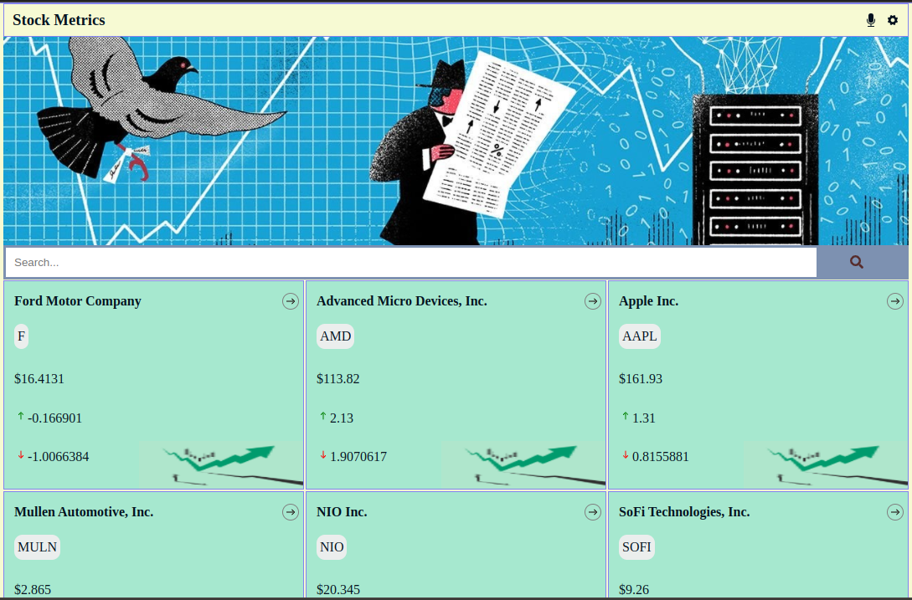
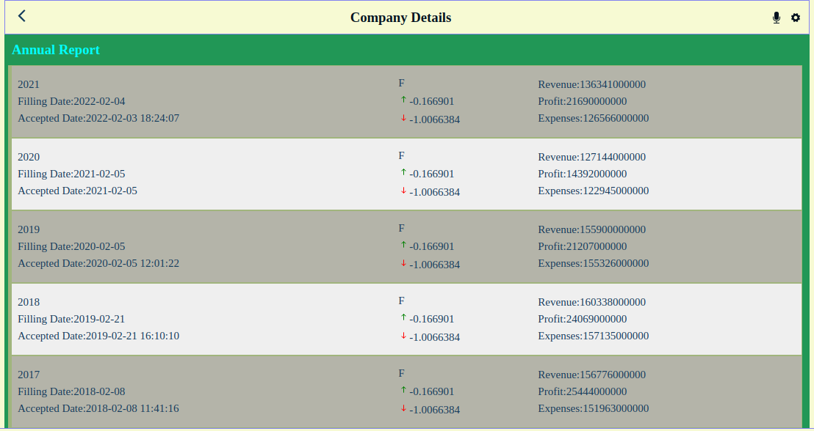
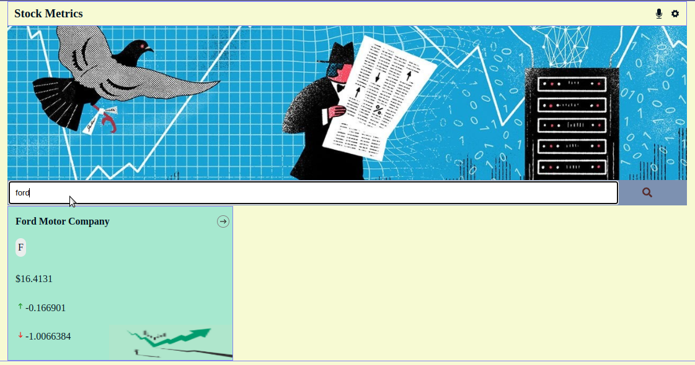

# Stock Metrics

> This app displays a list of popular stock market prices. Users can click on selected categories including forex, majors, cryptocurrencies, stocks, and ETFs. Each category lists the latest prices update for the pair. Consumes the [Financial Modeling Prep API] (https://site.financialmodelingprep.com/developer/docs).

This project is part of the Microverse curriculum React Capstone week. The main objective is to understand how create a React app, use components, hooks, state, redux, run tests, and creating professional documentation for app development..

## Built With

- React
- Redux
- Jest

## Live Demo

[Stock Metrics](https://arcane-earth-56373.herokuapp.com/)

## Getting Started

To get a local copy up and running follow these simple example steps:

### Prerequisites

- clone repo: `https://github.com/Gegardus/stock-metrics.git`

- then `cd stock-metrics`

### Install

- run `npm install` to install dependencies

- run `npm start` to enable webpack live server

## Contribute

Contributions, issues, and feature requests are welcome!

Feel free to check the [issues page](https://github.com/Gegardus/stock-metrics/issues)

## Author

👤 **Vahan Khachvankian**

- GitHub: [@githubhandle](https://github.com/Gegardus)
- Twitter: [@twitterhandle](https://twitter.com/Gegardus)

## Acknowledgements

- Original design idea by Nelson Sakwa on Behance., in association with the Creative Commons license of the design.

- A great thanks to My coding partners, morning session team, and standup team Partners for their contribution

- The author highly appreciates the help in the project from all the participants of this week's program - my coding partners, morning session team, and standup team partners - for their contribution.

## 📝 License

This project is [MIT](./MIT.md) licensed.
